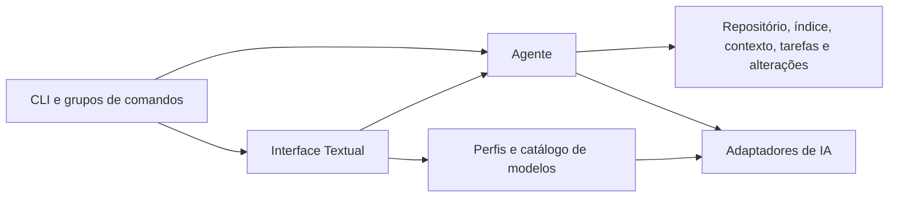

# Estrutura do projeto

O Codaro organiza o agente, os adaptadores de IA e a interface em pacotes separados.
Cada pacote possui uma responsabilidade; os dados persistidos e os comandos públicos
mantêm seus formatos anteriores.

```text
src/codaro/
├── cli.py                 # Entrada Typer e comandos centrais
├── cli_commands/          # Grupos de provedores, modelos e integrações
├── agent/
│   ├── controller.py      # Estado da sessão, permissões e loop com o modelo
│   ├── prompts.py         # Instruções compartilhadas e dos modos
│   ├── schemas.py         # Contratos das ferramentas internas
│   ├── arguments.py       # Validação de argumentos
│   ├── execution.py       # Despacho e execução das ferramentas
│   ├── reading.py         # Contexto inicial e visão geral do projeto
│   ├── results.py         # Ajuste dos resultados ao orçamento
│   ├── messages.py        # Classificação e processamento de mensagens
│   ├── output.py          # Recuperação e continuação de saída truncada
│   ├── events.py          # Eventos consumidos pelas interfaces
│   └── presentation.py    # Títulos e resumos das atividades
├── llm/
│   ├── config.py          # Settings, ambiente e reserva de contexto
│   ├── profiles.py        # Persistência e seleção de provedores BYOK
│   ├── catalog.py         # Descoberta de modelos e metadados
│   ├── endpoints.py       # URLs e normalização dos provedores
│   ├── factory.py         # Escolha do adaptador
│   ├── openai.py          # API OpenAI compatible, OpenAI, Groq e Gemini
│   ├── ollama.py          # Protocolo nativo Ollama
│   ├── anthropic.py       # Protocolo nativo Anthropic
│   ├── protocol.py        # Payloads, validação de mensagens e limites
│   ├── streaming.py       # SSE, fragmentos e cancelamento
│   └── errors.py          # Erros normalizados dos provedores
└── ui/
    ├── app.py             # Ciclo de vida e coordenação da interface
    ├── composer.py        # Campo de entrada e atalhos de edição
    ├── widgets.py         # Geração, atividades e propostas
    ├── reviews.py         # Revisão de alterações e aprovações
    ├── providers.py       # Cadastro, teste e seleção de provedores
    ├── integrations.py    # Cadastro de MCP e plugins
    ├── dialogs.py         # Diálogos de sessões e funcionalidades
    ├── palette.py         # Menu de comandos
    ├── formatting.py      # Apresentação de caminhos
    └── styles.tcss        # Estilos Textual distribuídos com o pacote
```

Os serviços de domínio continuam em módulos próprios na raiz: `repository.py`,
`index.py`, `context.py`, `continuity.py`, `memory.py`, `tasks.py`, `edits.py`,
`commands.py`, `policies.py`, `sessions.py`, `trace.py` e as integrações existentes.
Eles são compartilhados pela CLI, pelo agente e pela interface; não precisam conhecer
os componentes visuais.

## Fluxo e dependências



O agente recebe a solicitação, prepara o contexto e conduz o loop. Os adaptadores
traduzem o protocolo de cada API e normalizam erros. As ferramentas passam por
validação e pela política de aprovação antes da execução. A UI consome eventos e
coleta as decisões do usuário. A recuperação de saída truncada controla somente
tentativas e texto preservado; o controlador continua responsável pelas chamadas
ao modelo e pelos efeitos na tarefa.

`agent` não depende de Textual ou dos componentes de `ui`. `llm` não importa o
agente nem as interfaces. Dentro dos pacotes, use os módulos canônicos; os módulos
antigos de compatibilidade não devem virar novas dependências internas.

## Onde implementar mudanças

| Mudança | Local principal |
| --- | --- |
| Instruções do agente | `agent/prompts.py` |
| Ferramenta interna | `agent/schemas.py`, `arguments.py` e `execution.py` |
| Continuação de resposta | `agent/output.py` |
| Protocolo de um provedor | Adaptador em `llm`, registrado em `factory.py` |
| Descoberta de modelos | `llm/catalog.py` |
| Cadastro e seleção persistida | `llm/profiles.py` |
| Comando do menu Ctrl+P | `ui/palette.py` |
| Componente ou tela | `ui/widgets.py`, `reviews.py` ou módulo da tela |
| Aparência | `ui/styles.tcss` |
| Novo grupo de comandos CLI | `cli_commands`, com registro explícito em `cli.py` |

Os imports públicos anteriores continuam funcionando, incluindo `codaro.agent`,
`codaro.provider`, `codaro.providers` e `codaro.tui`. Os módulos de compatibilidade
reexportam os mesmos objetos, sem duplicar implementações. O executável continua
usando `codaro.cli:app`.

O controlador do agente e a aplicação Textual ainda concentram a coordenação dos
fluxos. Novas funcionalidades devem entrar nos módulos responsáveis, deixando
nesses dois arquivos apenas a integração e o estado compartilhado. Extrações futuras
precisam preservar cancelamento, limites de contexto, aprovação e a ordem dos eventos.

## Validação

```bash
pytest -q
ruff check src tests
ruff format --check src tests
python -m pip wheel . --no-deps -w /tmp/codaro-wheels
```

Os testes de arquitetura protegem as fronteiras de dependência. Os testes funcionais
cobrem o agente, os contratos HTTP, persistência, CLI e interação Textual headless.
Ao verificar uma distribuição instalada, confira também a inclusão de `styles.tcss`.
