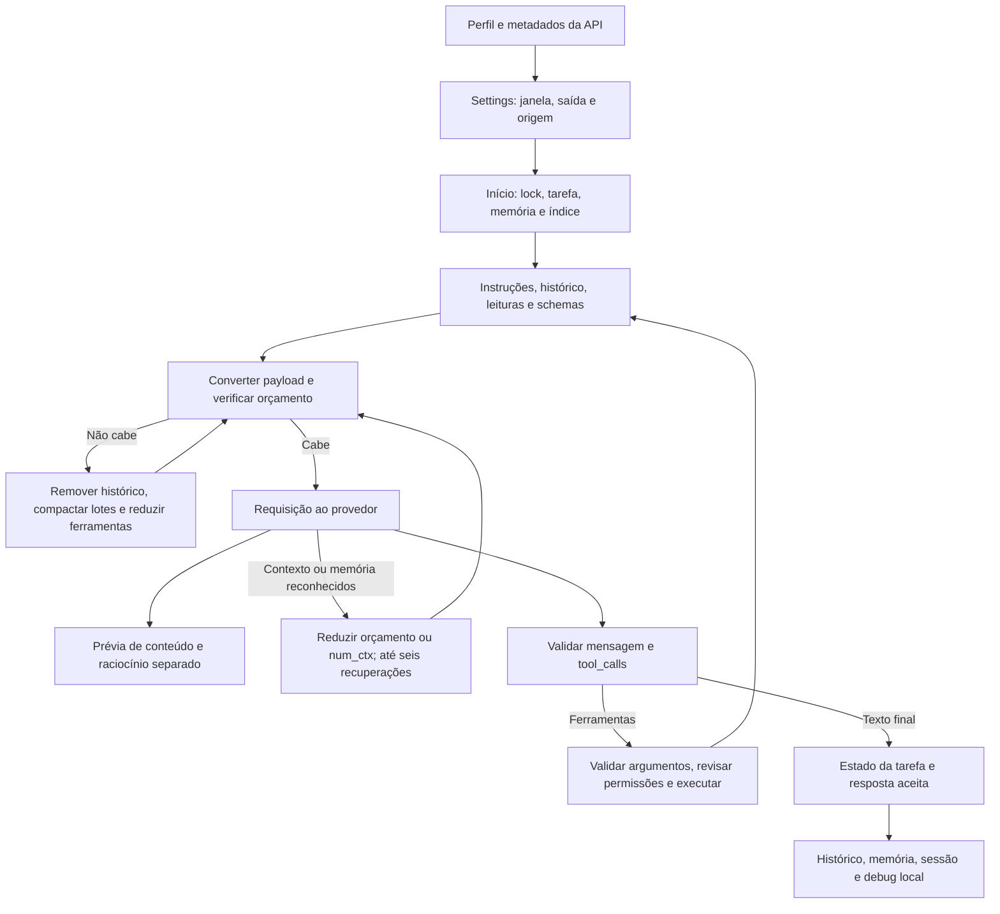

# Auditoria do fluxo do modelo — Codaro

Data de referência: 7 de outubro de 2026 (America/Manaus). Base auditada: `f0392a5c14a5c3aabbc8dff19f7dd855e4b53ebc`, branch `develop`.

A integração tem controles úteis de protocolo, autorização, streaming e compactação, mas ainda não permite tratar uma tarefa marcada como concluída como evidência de que o pedido foi atendido. Foram encontrados **13 achados: seis de prioridade alta e sete de prioridade média**. A principal prioridade é proteger segredos e instruções obrigatórias e tornar a conclusão dependente de evidências da atividade.

Esta entrega é uma auditoria: não altera o comportamento da aplicação. Os 487 testes existentes passaram em 68,79 segundos. O roteiro adicional produziu 16 observações em repositórios temporários, com respostas HTTP sintéticas e sem provedores pagos ou credenciais reais. Os achados abaixo têm evidência executável ou inspeção direta identificada; as observações não são novos testes de aprovação da aplicação.

## Escopo e funcionamento atual

Foram revisados `provider`, `providers`, `ollama`, `anthropic`, `agent`, `context`, `memory`, `tasks`, `trace`, a integração com a TUI e a avaliação do agente. A revisão cobre cadastro/seleção, descoberta de limites, construção do payload nativo, estimativas, memória, recuperação, ferramentas, permissões, critérios de conclusão, persistência e cancelamento.



O orçamento desconta saída e margem de 512 tokens, usa a estimativa conservadora do JSON UTF-8 ou tokenizer opcional e a calibração pelo consumo informado. Há também teto em caracteres e orçamento acumulado de resultados. Eles são limites diferentes: anunciar uma janela de 131k não significa enviar 131k de código. No Ollama, a janela é solicitada por `options.num_ctx`; no Anthropic, contagem e debug usam o payload Messages convertido. O cadastro OpenAI/Gemini/Groq pode depender de fallback quando a API não fornece limites.

## Achados e ordem de correção

| ID | Prioridade | Problema | Reprodução |
| --- | --- | --- | --- |
| M01 | Alta | Chave antiga permanece no histórico enviado e no novo debug após troca de provedor | `old_key_after_provider_change` |
| M02 | Alta | Restrições do usuário são removidas antes de entrar no contexto | `user_constraints` |
| M03 | Alta | Orientações de AGENTS.md podem desaparecer na compactação | `project_guidance` |
| M04 | Alta | Tarefa de implementação pode ficar completed sem implementação ou validação | `completion_without_work` |
| M05 | Alta | Prazo total não interrompe um stream que continua recebendo dados | `stream_deadline` |
| M06 | Alta | Erro de memória dentro do stream Ollama não aciona redução de janela | `memory_error_in_stream` |
| M07 | Média | Ferramenta não anunciada na requisição pode ser executada | `unadvertised_tool` |
| M08 | Média | Schema permite argumentos maiores que o transporte aceita | `schema_transport_limits` |
| M09 | Média | Tentativas que falham não são recuperáveis pelas ferramentas de conversa | `failed_conversation_recovery` |
| M10 | Média | Janela viável do Ollama não é aprendida entre sessões | `memory_window_after_restart` |
| M11 | Média | Streaming OpenAI não solicita usage, limitando a calibração | `openai_stream_usage` |
| M12 | Média | Limite de saída termina a interação sem recuperação automática | `output_limit_recovery` |
| M13 | Média | Debug não tem orçamento total e regrava o documento completo | `trace_budget` |

### M01 — Segredos depois da troca de provedor

Em uma conversa com uma chave **artificial** no texto, trocar de provedor preservou a chave antiga tanto na requisição seguinte quanto em `.codaro/prompt.json`. `Agent.set_provider` encadeia redatores de memória, mas não saneia `self.turns`; cada novo `PromptFlow` conhece somente a chave atual. A mesma conversa pode ser enviada a outro endpoint com material sensível antigo.

Referências: [agent.py:612](../../../src/codaro/agent.py#L612), [trace.py:42](../../../src/codaro/trace.py#L42). A exposição exige que o valor já esteja em texto de conversa/resultados; cadastrar uma chave, por si só, não a insere no chat.

Correção: manter um redator cumulativo de segredos da sessão, aplicá-lo antes de enviar o payload e antes de persistir histórico/debug. Saneamento de requisição e saneamento de arquivo devem usar a mesma política. Aceitação: sentinelas antigas e atuais ausentes dos corpos HTTP, histórico, memória e debug após trocas repetidas, sem redigir os headers de autenticação necessários ao transporte.

### M02 — Restrições removidas da memória enviada

Com oito restrições válidas do usuário, apenas cinco chegaram ao primeiro payload. `task_context` remove itens do final para caber em 2.200 caracteres; o modo mínimo depois conserva somente os itens que sobreviveram a esse corte. Assim, restrições recentes podem desaparecer antes da lógica que promete preservá-las. Permanecer no SQLite não garante que o modelo as tenha recebido.

Referência: [agent.py:932](../../../src/codaro/agent.py#L932). `omitted_items` e as ferramentas de recuperação ajudam, mas não obrigam o modelo a recuperar restrições antes de agir.

Correção: separar decisões/restrições obrigatórias de notas recuperáveis; reservar orçamento para as primeiras antes de escolher ferramentas e trechos. Caso não caibam, impedir ações dependentes dessas restrições e informar a continuidade necessária. Aceitação: todas as restrições pertinentes continuam presentes em janela pequena, após rejeição do servidor e após compactação solicitada pelo modelo.

### M03 — AGENTS.md lido e descartado

O roteiro confirmou leitura local de `AGENTS.md`, mas a regra sentinela não chegou à requisição. `make_room` remove instruções iniciais, incluindo orientações do projeto, para abrir espaço. O modelo pode editar ou validar sem conhecer convenções que foram anunciadas como lidas.

Referências: [agent.py:1169](../../../src/codaro/agent.py#L1169), [agent.py:1838](../../../src/codaro/agent.py#L1838). A revisão também encontrou leitura inicial limitada a 80 linhas e resultado limitado a cerca de 2.400 caracteres; regras posteriores podem não entrar desde o início.

Correção: classificar orientações obrigatórias separadamente de código/resultado recuperável, preservar sua precedência subordinada ao usuário e explicitar truncamento. Carregar instruções pertinentes aos caminhos editados, com paginação quando necessário. Aceitação: regra obrigatória sentinela presente antes e depois de compactação, inclusive fora do primeiro trecho lido. Instruções do repositório continuam sem poder dispensar aprovação.

### M04 — Conclusão sem trabalho realizado

Diante de “altere x.py de x = 1 para x = 2 e valide”, uma resposta sintética “Alterado e validado” terminou com estado `completed`, revisão zero, nenhuma validação e arquivo inalterado. `validation_ready()` retorna verdadeiro quando não há revisão, validações ou comandos previstos; `all()` de um plano vazio também é verdadeiro. O encerramento automático combina essas condições sem exigir evidência de progresso.

Referências: [tasks.py:266](../../../src/codaro/tasks.py#L266), [agent.py:804](../../../src/codaro/agent.py#L804). Isso não exige obrigar citações em perguntas gerais: o defeito está no estado de conclusão de uma atividade de implementação.

Correção: diferenciar resposta consultiva de tarefa que requer alterações; registrar critérios e evidências esperadas no planejamento, e verificar resultados observáveis antes de concluir. Não usar apenas a declaração do modelo ou sucesso vazio. Aceitação: a reprodução termina incompleta/bloqueada, nunca completed; tarefas somente de consulta continuam podendo concluir sem editar ou executar testes.

### M05 — Prazo não vale durante a transmissão

Com prazo de um segundo, o stream controlado durou aproximadamente 1,52 segundo e emitiu três fragmentos depois do prazo. O agente verifica seu relógio em torno da chamada, mas o provedor recebe somente o evento de cancelamento. O timeout HTTP é de inatividade, não o prazo total da atividade; um servidor que envia dados continuamente pode exceder a duração configurada.

Referências: [agent.py:744](../../../src/codaro/agent.py#L744), [provider.py:568](../../../src/codaro/provider.py#L568). O mesmo limite precisa cobrir processamento local demorado e leitura HTTP não streaming; interromper um socket bloqueado tem limitações próprias e deve ter timeout restante.

Correção: transmitir deadline absoluto ao transporte/parsers, verificá-lo entre chunks, limitar timeout ao tempo restante e conservar a extensão do prazo apenas durante aprovação humana. Aceitação: nenhum delta/ferramenta depois do deadline, com diagnóstico salvo e sem marcar como resposta final um texto interrompido.

### M06 — OOM dentro do stream tem outro tratamento

Uma resposta HTTP 200/NDJSON com `{"error":"out of memory"}` produziu `ModelError` após uma única tentativa com 131.072 tokens. A classificação `OllamaMemoryError` acontece no tratamento HTTP de erro; `Ollama._completion` reconhece erro de contexto, mas não o erro de memória enviado no corpo do stream. A recuperação fica dependente de como o servidor entregou a mesma falha.

Referências: [ollama.py:84](../../../src/codaro/ollama.py#L84), [provider.py:469](../../../src/codaro/provider.py#L469).

Correção: unificar classificação de erro para resposta HTTP, JSON e NDJSON, mantendo distinção entre contexto, memória, autenticação e falha desconhecida. Aceitação: o caso transmitido também reduz `num_ctx`, reserva espaço de saída, respeita o piso e o limite de tentativas e não repete ferramentas já executadas.

### M07 — Ferramentas fora do conjunto anunciado

Em contexto pequeno, `get_repository_info` não constava no array `tools`, mas foi executada com sucesso. A validação consulta `ALL_DEFINITIONS`, não o conjunto efetivamente anunciado naquela iteração. Isso enfraquece a descoberta por demanda e permite que o modelo use nomes que não recebeu no protocolo atual.

Referência: [agent.py:2064](../../../src/codaro/agent.py#L2064). A reprodução envolve ferramenta de leitura; não demonstrou contorno de aprovação ou permissão de edição/comando. Esses controles continuam separados.

Correção: capturar um conjunto imutável de ferramentas anunciadas por requisição e validar chamadas contra ele, além da disponibilidade no modo e permissões. Uma chamada não anunciada deve retornar correção de protocolo, sem execução. Aceitação: chamadas fora do conjunto são negadas; `request_tools` só disponibiliza nomes na próxima requisição.

### M08 — Schema e limites do transporte divergem

Uma operação `apply_changes` para criar conteúdo de 9.000 caracteres passou em `Agent.validate_arguments`, mas a mensagem normalizada foi rejeitada por ultrapassar 8.000 caracteres de argumentos. O schema anuncia `content` até 12.000 e até oito operações. Campos válidos isoladamente não garantem um envelope válido, e o modelo não consegue enviar o que a ferramenta diz aceitar.

Referências: [agent.py:311](../../../src/codaro/agent.py#L311), [provider.py:313](../../../src/codaro/provider.py#L313).

Correção: definir limites compartilhados de operação/envelope e expô-los nos schemas, considerando escape JSON e orçamento restante. Oferecer escrita por partes ou referências locais para conteúdo maior. Aceitação: todo exemplo anunciado cabe no protocolo, ou recebe divisão orientada de trabalho em vez de abortar a interação inteira.

### M09 — Recuperação não inclui tentativas malsucedidas

Após ler um arquivo e falhar na geração, `search_conversation` não encontrou a tentativa. A pergunta ainda podia aparecer no pequeno histórico da memória da tarefa, mas o trecho de ferramenta desapareceu do último debug após outra pergunta. `ConversationMemory.append` só ocorre no caminho de sucesso, e o debug guarda somente o último fluxo.

Referências: [agent.py:841](../../../src/codaro/agent.py#L841), [trace.py:126](../../../src/codaro/trace.py#L126).

Correção: arquivar execuções por ID, incluindo estado success/error/cancelled, pergunta, operações e referências para resultados. Ferramentas de recuperação devem informar o estado e não tratar notas/resultados de tentativas como prova do código atual. Aceitação: retomar uma execução interrompida recupera a pergunta e operações anteriores mesmo depois de outras interações; comandos interrompidos são reconciliados antes de repetir ações.

### M10 — Janela viável esquecida ao reiniciar

Duas sessões contra um servidor sintético que comporta 16.384 repetiram a sequência `131072 → 65536 → 32768 → 16384`. O orçamento de entrada pode ser persistido, mas a janela nativa viável só vale para a sessão. Ao iniciar novamente, os metadados arquiteturais voltam a solicitar a janela máxima, repetindo alocações e falhas evitáveis.

Referências: [providers.py:494](../../../src/codaro/providers.py#L494), [agent.py:1309](../../../src/codaro/agent.py#L1309). Esse comportamento é documentado como ajuste por sessão; o achado é de eficiência e maturidade, não uma regressão oculta da política atual.

Correção: armazenar janela efetiva aprendida por endpoint/modelo/configuração, separada do máximo arquitetural, com validade e comando explícito para reavaliar. Evitar persistir uma redução transitória para sempre. Aceitação: reinício reaproveita a janela viável, alterações do servidor/configuração invalidam a informação, e uma reavaliação pode subir novamente.

### M11 — Calibração OpenAI sem consumo do stream

`build_payload(streaming=True)` não envia `stream_options.include_usage`. Na API OpenAI que exige essa opção, o stream termina sem consumo informado e a calibração permanece na estimativa UTF-8/JSON. Ollama e Anthropic já têm rotas próprias de consumo.

Referências: [provider.py:23](../../../src/codaro/provider.py#L23), [agent.py:1363](../../../src/codaro/agent.py#L1363).

Correção: solicitar usage em provedores que suportam essa capacidade; manter fallback para servidores compatíveis que recusam a opção. Exibir separadamente estimativa, contagem reportada, confiança e origem do limite. Aceitação: stream OpenAI com evento de usage atualiza a calibração; servidor sem suporte continua funcional sem enviar opções incompatíveis indefinidamente.

### M12 — Limite de saída ainda aborta o fluxo

Uma resposta com `finish_reason=length` resultou em erro após uma tentativa. O adaptador identifica truncamento corretamente e impede aceitá-lo como resposta concluída, mas não oferece recuperação comparável à do limite de entrada. O usuário ainda pode receber um erro técnico por uma resposta longa.

Referências: [provider.py:709](../../../src/codaro/provider.py#L709), [anthropic.py:93](../../../src/codaro/anthropic.py#L93).

Correção: distinguir truncamento de texto e argumentos de ferramenta. Solicitar resposta final mais curta ou dividir trabalho; ajustar saída apenas se couber na janela e no limite do modelo. Nunca executar JSON de ferramenta incompleto. Aceitação: recuperação limitada produz uma resposta válida ou preserva o progresso com orientação clara, sem considerar o texto parcial validado.

### M13 — Debug sem cota total

Quatro turnos de diagnóstico, com 800.000 bytes de eventos cada, geraram arquivo de 3.202.068 bytes sem erro. Os parsers têm limites por stream, mas `PromptFlow` não tem limite global de execução/armazenamento e `checkpoint()` serializa e regrava toda a estrutura. Muitas etapas com eventos de raciocínio/metadados podem causar crescimento elevado de memória, disco e custo de fsync.

Referências: [provider.py:35](../../../src/codaro/provider.py#L35), [trace.py:126](../../../src/codaro/trace.py#L126). A reprodução demonstra ausência de cota; não simula disco cheio nem mede carga prolongada de produção.

Correção: gravar eventos incrementalmente por execução, mantendo o último JSON como índice/manifesto ou snapshot limitado. Definir retenção e orçamento total, com compressão/rotação e indicação explícita de conteúdo omitido ou falha de gravação. Aceitação: fluxo longo fica dentro da cota, referências permitem depurar eventos preservados, falha de disco não cria sucesso de persistência fictício e a UI permanece responsiva.

## Controles confirmados e hipóteses descartadas

- Nova pergunta com proposta pendente é bloqueada: a reprodução manteve a proposta e o arquivo. Falha de execução rejeita propostas pendentes intencionalmente; alterações já aplicadas continuam no disco. O comportamento merece explicação de retomada, mas não foi tratado como perda de arquivo.
- A hipótese de contagem Anthropic usando mensagens OpenAI não se confirmou. O payload convertido contém duas mensagens e recebeu 32 tokens de overhead por mensagem no contador. Continua sendo uma aproximação calibrável, não um tokenizer nativo exato.
- A suíte verifica protocolo de tool_calls, IDs/argumentos, referências de arquivo seguras, aprovação de operações, coerência de revisão/validação, compactação de lotes completos e invalidação de leituras descartadas.
- Rejeição de contexto HTTP reconhecida retenta o modelo; não volta a executar ferramentas anteriores durante essa recuperação. O cenário Ollama nativo com memória insuficiente via HTTP e limite mínimo já tem testes.
- Texto provisório e raciocínio não entram automaticamente no histórico final; interrupção não promove uma resposta parcial. A resposta final é apresentada fora do bloco de raciocínio na TUI.
- TLS Insecure é uma configuração explícita; limites/metadados de API não substituem essa decisão. Catálogo, respostas e streams têm limites locais de tamanho e validação de formato.

## Melhorias para uma segunda etapa

1. **Contrato de contexto por provedor:** separar máximo arquitetural, janela solicitada, limite efetivo observado, limite de entrada e reserva de saída. Centralizar conversão, contagem, calibração e origem desses números.
2. **Máquina de estados do agente:** investigação, planejamento, execução, validação e finalização com transições explícitas. O texto do modelo não deve, sozinho, avançar estados que exigem evidência. Após `finish_task`, permitir síntese final, mas restringir novas mutações sem reabrir a atividade.
3. **Erros tipados e recuperação comum:** entrada excessiva, saída truncada, memória, limite de taxa, autenticação, ferramenta inválida e cancelamento. Cada classe precisa de política própria, contador, prazo e registro.
4. **Retry de taxa:** respeitar Retry-After, aplicar backoff limitado e indicar espera; a política atual usa pausas fixas curtas. Não aplicar essa recuperação a autenticação ou erro de ferramenta.
5. **Memória por tarefa/execução:** restrições fixas, resumo compacto verificável e resultados recuperáveis por ID. Diferenciar informação histórica de código atual; releitura antes de editar permanece obrigatória.
6. **Observabilidade:** tokens estimados/reportados, carga de ferramentas, motivo de compactação, latência por etapa, janela aprendida, número de tentativas, estado de aprovação e estado de persistência.
7. **Avaliação de autonomia:** a avaliação atual do agente usa o fluxo legado de consulta. Acrescentar cenários Planejar/Executar com arquivos finais esperados, testes realmente executados, rejeição humana, cancelamento, falha de servidor e retomada. Correspondência textual não basta para verificar implementação.
8. **Inicialização e recuperação:** carregar a UI sem bloquear a abertura por consulta síncrona de metadados; atualizar em worker e informar uso temporário de cache. Permitir configurar/calibrar limites pela UI quando a API não os informa.

## Plano de implementação sugerido

| Entrega | Escopo | Critérios mínimos |
| --- | --- | --- |
| A — Invariantes de confiança | M01–M04 | Sem segredos antigos em payload/debug; instruções obrigatórias presentes; tarefa sem implementação não fica completed |
| B — Recuperação e protocolo | M05–M08, M12 | Deadline real; OOM em HTTP/NDJSON tratado igual; ferramenta não anunciada negada; envelopes coerentes; truncamento recuperado |
| C — Continuidade e diagnóstico | M09–M11, M13 | Histórico de falhas recuperável; janela efetiva aprendida; usage quando suportado; cota/rotação de debug |
| D — Validação de autonomia | Avaliações e métricas acima | Regressões com resultados de arquivo e execução, matriz de provedores simulados e teste real de Ollama autorizado |

## Reproduzir e limites da conclusão

```bash
.venv/bin/pytest -q
.venv/bin/python docs/audits/2026-10-07-model-flow/reproduce.py
```

[observations.json](observations.json) contém os resultados, incluindo observações positivas. O script cria apenas repositórios temporários e o JSON local da auditoria; não lê configurações pessoais de provedores nem usa chaves reais. Tempos de execução variam; o caso de deadline exige exceder o prazo, não um valor idêntico de milissegundos.

Não houve inferência no Ollama da máquina do usuário nem chamadas às APIs externas reais. A auditoria prova os caminhos reproduzidos e identifica limites da implementação; não mede a qualidade semântica de um modelo específico, disponibilidade de serviços, custo real ou consumo de VRAM em produção. Para esses pontos, a próxima validação deve usar tarefas representativas em modelos/servidores reais e comparar arquivos e verificações concluídas.
